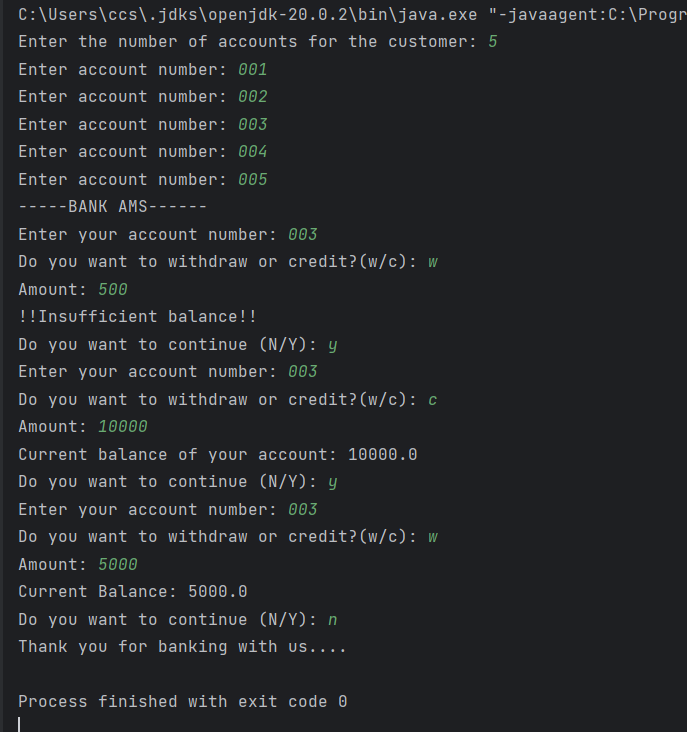

# Bank-Application
Simple Java Bank Application
This is a basic banking application implemented in Java as part of a learning project. The application allows users to perform essential banking operations such as adding a bank account, depositing money, and withdrawing funds. It serves as a fundamental demonstration of object-oriented programming concepts and basic Java functionalities.

# Features:
Create Bank Accounts: Users can create new bank accounts by providing necessary details such as account number, account holder's name, and initial balance.

Deposit Money: Deposits can be made into existing accounts. Users can specify the account number and the amount to be deposited.

Withdraw Money: Funds can be withdrawn from existing accounts, and the application verifies if there are sufficient funds available before processing the withdrawal.

Check Balance: Users can check the current balance of their accounts. The application displays the balance along with information about the possibility of withdrawing more funds.

Error Handling: The application includes basic error handling to address scenarios such as entering an incorrect account number.

Note: This is a simple, primary implementation and may lack certain features for a real-world banking application.

### Output Preview

